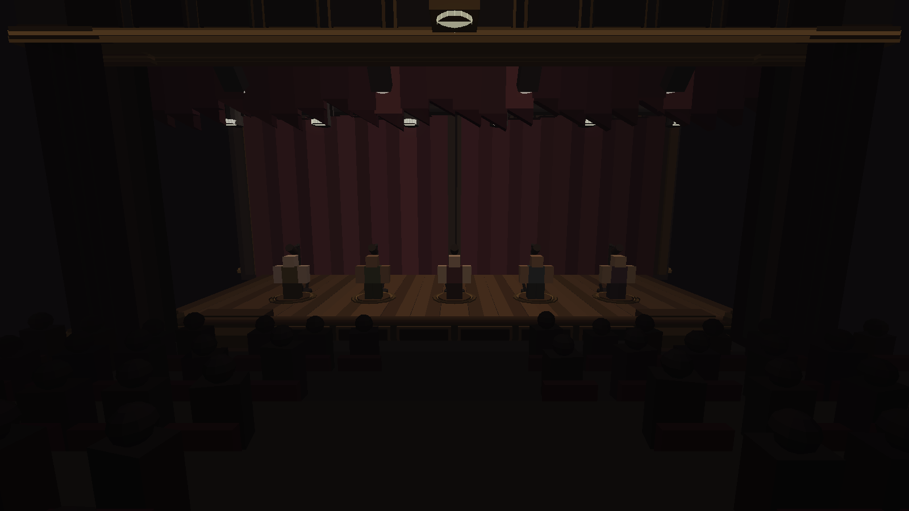
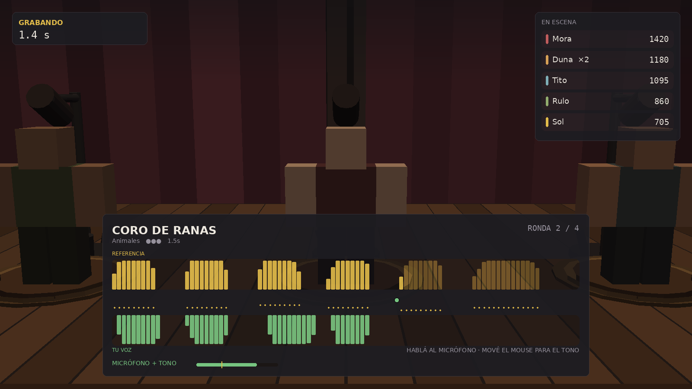
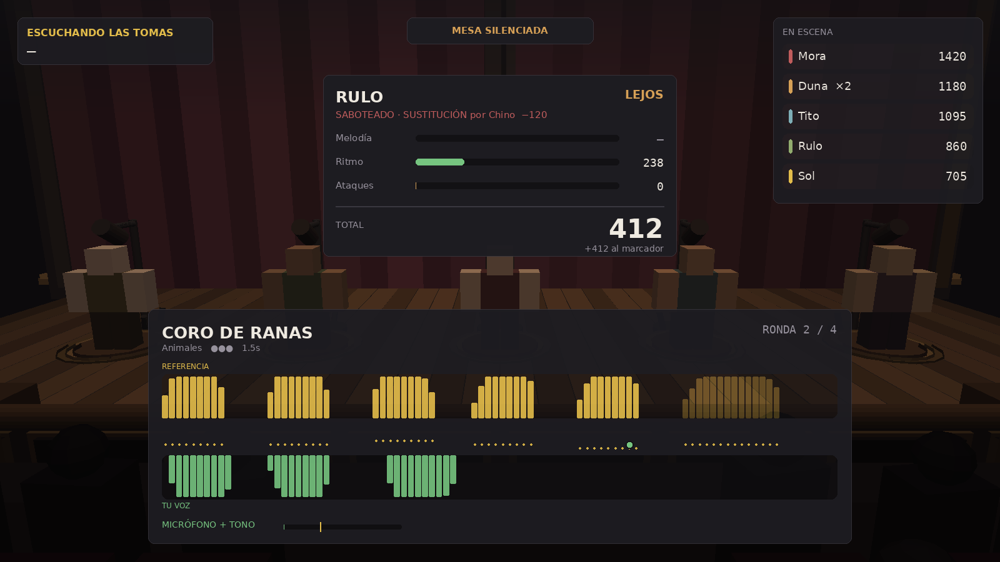

# Mimic Party — Roblox

Una recreación completa de **Mimic Party** (FoliesAPP) para Roblox: fiesta de voz
de 2–5 jugadores, una sola toma por ronda, puntuación de melodía/ritmo/ataques
y ruleta con sabotajes, en un teatro construido por código.

```
rojo build -o MimicParty.rbxlx     # ya está hecho: abrí MimicParty.rbxlx
```

---

## 1. El micrófono: qué entra de verdad

**El juego te escucha.** El chat de voz está activado en el place
(`VoiceChatService.EnableDefaultVoice = true`), tu micrófono se cablea a un
`AudioAnalyzer`, y lo que decís mueve la forma de onda verde en vivo.

Lo que la plataforma permite y lo que no, verificado contra la referencia del
motor y no de memoria:

| Del micrófono real | ¿Roblox lo da? |
|---|---|
| Que estás hablando, buffer por buffer (`RmsLevel` / `PeakLevel`) | **Sí**, solo en el cliente |
| Envolvente de volumen → tu forma de onda real | **Sí** |
| **Ataques** (cuántas veces lo golpeaste) | **Sí**, desde tu voz |
| **Ritmo** (cuándo lo golpeaste) | **Sí**, desde tu voz |
| **Tono / melodía** (`GetSpectrum`) | **No.** Devuelve array vacío si alguna entrada viene de un `AudioDeviceInput` |

Ese último renglón es una decisión de Roblox, por privacidad, no un límite de
este código. Staff de Roblox, 6 de octubre de 2026: *"this is on our roadmap to
explore but I'm sorry to say we still don't have a timeline."* El día que lo
abran, la melodía sale de la voz cambiando un solo módulo — `VoiceInput.luau`,
que ya deja `SpectrumEnabled` apagado justo por eso.

Así que **dos de los tres ejes del puntaje salen de tu voz real**, y el tono
sale de la altura del puntero. Tres modos, resueltos por jugador y por toma:

| Modo | Voz | Tono | Cuándo se usa |
|---|---|---|---|
| `voice` | micrófono | puntero | **por defecto** |
| `voice_only` | micrófono | — | si no querés tocar el mouse. Se descarta la melodía y **su peso se redistribuye**, así un 1000 sigue siendo alcanzable |
| `pointer` | mantener apretado | puntero | sin micrófono, sin permiso de voz, o cliente viejo |

El modo viaja con la toma y **el servidor grada con los pesos de ese modo**, así
que nadie se puntúa en un eje que no podía manejar. En la tarjeta de puntaje, un
eje que no contó se muestra como "—", no como 0: un cero se lee como que fallaste.

### El grafo de voz, cableado a mano

Nada de esto queda en manos de los valores por defecto del motor. La cadena, con
la API de audio actual:

```
AudioDeviceInput  (.Player = ese jugador, .Muted, .Volume)
     └─ Wire ─→  AudioEmitter  (en su cabeza, con DistanceAttenuation)
                      └─ lo capta el AudioListener que da
                         SoundService.ListenerLocation = Camera
                              └─ AudioDeviceOutput  (lo provee el motor)
```

Tener los cables propios es lo que compra las tres cosas que este juego necesita:

1. **Un silencio real.** Cerrar la mesa durante la reproducción pone `.Muted` en
   una entrada real, así todos escuchan la misma toma y no a cinco personas
   reaccionando encima.
2. **Alcance.** La sala tiene ~45 studs de profundidad; la curva de atenuación
   está ajustada para que una voz en el escenario llegue a la última fila sin
   que los cinco se conviertan en puré cuando hablan todos juntos.
3. **Volumen por jugador**, para la ventana de reacción.

Y un bug mío que esto arregló: mi `VoiceGate` usaba `AudioDeviceInput.Active`,
que está marcada **"Roblox Script Security"** — un script de juego no puede
escribirla. La propiedad correcta es **`.Muted`**, que es la que usa el ejemplo
oficial de push-to-talk. El silenciado durante la escucha nunca habría
funcionado. `VoiceGate.luau` quedó reemplazado por `VoiceChat.luau`.

También hay un re-cableado periódico cada 5 segundos: un respawn, un personaje
que recarga o una voz que se provisiona tarde invalidan el emisor, y un chat de
voz mudo es la peor falla posible en este juego.

Lo que **ninguna configuración** puede hacer es darle voz a una cuenta que no la
tiene: Roblox pide verificación de edad, por usuario. Esos jugadores entran en
modo puntero y se les dice por qué, en pantalla. `VoiceChat.report()` existe
justo para eso: te dice, por jugador, si tiene entrada, si está silenciado y si
está cableado, para que "no funciona el micrófono" sea contestable sin un
programador al lado.

### El detector de ataques

De un flujo de volumen hay que sacar ataques limpios. `VoiceInput.Gate`:

- **Calibración por toma.** El piso de ruido se mide **durante la cuenta atrás**,
  con el percentil 60 (no la media, para que una tos no suba el piso de toda la
  toma). Calibrar sale gratis: para el "¡YA!" el gate ya está ajustado a tu
  micrófono y a tu habitación. Ninguna configuración que tocar.
- **Histéresis.** Abre en 3.1× el piso y cierra en 1.7×. Abrir y cerrar en el
  mismo umbral hace castañetear el gate con una voz con aire.
- **Puente de sílaba.** Un bache de menos de 40 ms no termina la nota: es una
  sílaba, no un corte.
- **Refractario.** Un ataque nuevo no arranca dentro de 50 ms del anterior.

Esos dos números **no están puestos a ojo, están puestos contra la librería.** El
hueco más chico de los 36 sonidos es de 90 ms, así que el puente tiene que estar
cómodamente por debajo de 90 (si no, un patrón rápido se colapsa en un solo
ataque y el eje de ataques —un cuarto del puntaje— se va a cero) y por encima de
~33 ms (dos frames a 60 fps, si no castañetea). 40 ms cae en esa ventana con
50 ms de margen.

**La primera versión de este archivo tenía huecos de 20 ms y estaba roto:** un
tartamudeo de 6 golpes se leía como 1 ataque. Un frame a 60 fps son 16.7 ms, y
una garganta humana no articula 20 ms tampoco. Los 36 sonidos se re-escribieron
con un mínimo de 90 ms entre notas y 100 ms de duración mínima — 33 de los 36 se
alargaron. Ahora son ejecutables con la voz, que es el punto.

Verificado con el código real del gate, simulando 60 fps:

```
silencio con ruido de fondo                ataques 0  notas 0
un ataque simple                           ataques 1  notas 1   0.00+0.30
Coro de Ranas (6 golpes, huecos 90 ms)     ataques 6  notas 6
Percusion (6 golpes, huecos 90 ms)         ataques 6  notas 6
una palabra con bache de 30 ms             ataques 1  notas 1   ← no la parte
nivel entre los dos umbrales               ataques 1  notas 1   ← no castañetea
duracion medida de un golpe de 0.300 s: 0.300 s (error 0 ms)
```

Todo degrada: sin permiso de voz, sin micrófono, micrófono denegado o cliente
viejo → cae a puntero y te dice por qué, en pantalla. Una toma nunca falla por
esto.

## 2. Publicar y conseguir el link

**Hacé doble clic en `MimicParty.rbxl` y se abre solo en Roblox Studio.** Eso es
todo: es un archivo de lugar de Roblox, Studio es su programa asociado. Van los
dos formatos — `.rbxl` (binario, el que abre más rápido) y `.rbxlx` (XML, el que
podés leer y diffear en git).

1. Doble clic en **`MimicParty.rbxl`**.
2. Probalo ahí mismo: **Test → Start** (o F5). Para probar la fiesta con varios
   jugadores: **Test → Clients and Servers → 2 Players → Start**.
3. **File → Publish to Roblox As…**, ponele nombre, Create.
4. En **Home → Game Settings → Permissions**, pasalo a **Public**.
5. El link aparece en [create.roblox.com](https://create.roblox.com) → Creations
   → tu juego → el botón de los tres puntos → **Copy Game Link**.

**El chat de voz ya viene activado en el archivo** — es lo que usa el juego para
escucharte. Si Studio te pide confirmarlo, está en Game Settings → Communication
→ Voice Chat. Para publicarlo con voz, tu cuenta necesita verificación de edad
en Roblox; sin eso el juego sigue andando y cae a modo puntero.

### Si preferís trabajar con Rojo

```bash
rojo serve          # y conectá el plugin de Rojo desde Studio
rojo build -o MimicParty.rbxlx
```

## 2b. Salas privadas por código

El menú ahora tiene **CREAR SALA** y un campo de código. Y las salas no son
canales dentro de un servidor: **cada sala es un servidor reservado aparte de
este mismo lugar**, que es lo que permite que haya cinco fiestas simultáneas.

```
el anfitrión aprieta CREAR
  → TeleportService:ReserveServerAsync(game.PlaceId) devuelve un código de
    acceso a un servidor nuevo y vacío de ESTE MISMO lugar
  → se reclama un código humano de 5 caracteres en un DataStore, apuntando a
    ese código de acceso
  → el anfitrión viaja ahí, llevando los ajustes de la sala en el teleport data

alguien escribe el código
  → el DataStore lo convierte de vuelta en el código de acceso
  → TeleportAsync con ReservedServerAccessCode lo deja en el mismísimo servidor
```

El código tiene que vivir en algún lugar que los dos servidores puedan leer —
de ahí el DataStore. Se reclama con `UpdateAsync`, que es la única forma de que
dos servidores compitiendo por los mismos cinco caracteres no ganen los dos.

**El alfabeto de los códigos no tiene O/0, I/1 ni S/5.** Un código se lee en voz
alta por el chat de voz, y esos son los pares que la gente confunde. 30 símbolos,
5 lugares: 24.3 millones de combinaciones.

### Lo que controla el anfitrión

Exactamente dos cosas:

- **Qué paquetes de sonidos entran.** Interruptores en vivo. No puede apagar el
  último: una librería vacía no es una sala válida.
- **A quién saca.** Un botón por jugador. No puede sacarse a sí mismo.

**Y deliberadamente nada más.** Sin editar puntajes, sin saltear rondas, sin
silenciar a alguien en particular. Un anfitrión que pudiera silenciar a una
persona rompería la única regla sobre la que está construido el juego.

Si el anfitrión se va, la sala pasa a quien lleva más tiempo adentro — una
conexión caída no debería dejar la sala sin manejar. Los no-anfitriones ven los
mismos paquetes y el mismo roster, en gris: esconderlo dejaría a cuatro personas
adivinando por qué desapareció un paquete a mitad de la fiesta.

### Lo que tenés que activar vos

Dos interruptores, los dos en tu cuenta, y el juego te dice en pantalla cuál
falta en vez de fallar en silencio:

1. **DataStores** — las salas no funcionan sin esto. En un juego publicado ya
   vienen activos. Para probar en Studio: **Game Settings → Security → Enable
   Studio Access to API Services**. El servidor hace una lectura de prueba al
   arrancar, así que si está apagado el botón CREAR SALA aparece deshabilitado
   con el motivo escrito, en lugar de romperse cuando lo apretás.
2. **Chat de voz** — ya viene activado en el archivo
   (`VoiceChatService.EnableDefaultVoice = true`). Para publicarlo con voz tu
   cuenta necesita verificación de edad en Roblox.

Un lugar sin publicar no puede reservar servidores (`game.PlaceId == 0`), así que
publicá una vez antes de probar las salas. El juego te lo dice con esas palabras.

## 3. Cómo se juega

```
    hablá / gritá / ladrá al micrófono  →  volumen, ataques y ritmo (tu voz real)
    mover el mouse arriba y abajo       →  tono, ±9 semitonos
```

Sin micrófono, mantené apretado (mouse / Espacio / dedo) en lugar de hablar.

Una ronda, en orden:

1. **Referencia** — el sonido suena para toda la mesa. Arriba, en amarillo, su
   forma de onda; en el medio, su contorno de tono como línea de puntos.
2. **Cuenta atrás** — 3 · 2 · 1 · ¡YA!, igual para todos.
3. **Toma** — todos graban a la vez. Hablás al micrófono y tu voz se dibuja en
   verde abajo, en vivo, con su curva de volumen real. Abajo del todo tenés el
   medidor de micrófono, con el umbral del gate marcado encima: podés ver qué
   cuenta como sonido. Se corta en seco al final. No hay repetir.
4. **Escucha** — las tomas suenan una por una. La mesa queda silenciada para que
   todos oigan lo mismo. Cada una muestra sus tres medidores y su total.
5. **Ruleta** — un giro para toda la mesa: puntos, multiplicadores o sabotajes.
   Si te toca un sabotaje, elegís víctima; la víctima no se entera hasta que
   suena su propia toma en la ronda siguiente.

Cuatro rondas, y resultados.

## 4. La puntuación

`src/Shared/Scoring.luau`. Tres ejes, cada uno 0–1000:

| Eje | Qué mide | Peso |
|---|---|---|
| **Melodía** | El contorno, **centrado en su media antes de comparar** | 0.40 |
| **Ritmo** | Error de ataque a ataque, penalizado si sobran o faltan | 0.35 |
| **Ataques** | Cuántas veces lo golpeaste | 0.25 |

Ese centrado en la media es la regla que importa: **tu registro no cuenta**. Una
voz grave y una aguda trazando la misma forma puntúan idéntico. Verificado:

```
copia exacta                       mel 1000  rit 1000  atk 1000  TOTAL 1000
misma forma, 12 semitonos arriba   mel 1000  rit 1000  atk 1000  TOTAL 1000
misma forma, 7 semitonos abajo     mel 1000  rit 1000  atk 1000  TOTAL 1000
ritmo corrido 80 ms                mel  823  rit  771  atk 1000  TOTAL  849
falta un ataque                    mel  720  rit  667  atk  667  TOTAL  688
ataques de más (6 en vez de 3)     mel  822  rit  238  atk    0  TOTAL  412
silencio total                     mel    0  rit    0  atk    0  TOTAL    0
```

El servidor es el único que puntúa. El cliente manda solo el contorno, y
`TakeStore.luau` lo sanea antes de que llegue a `Scoring`: recorta tiempos y
tonos al rango legal, descarta NaN, limita a 48 notas y rechaza una segunda
toma. Un cliente modificado no puede inventarse un 1000.

**Para ajustar la dureza:** `Config.SCORING`. `MELODY_TOLERANCE` (semitonos de
error que anulan el eje) y `RHYTHM_TOLERANCE` (segundos) son los dos diales
reales. Un contorno invertido saca 776 hoy, porque ritmo y ataques siguen
perfectos; si querés castigarlo más, subí `WEIGHT_MELODY`.

## 5. La ruleta y los sabotajes

`Roulette.luau` · `Sabotages.luau`. Once segmentos con pesos; alrededor de un
tercio de los giros reparte sabotaje. Los cinco son **SoundEffects nativos de
Roblox aplicados a la toma en vivo** — la toma se arruina de verdad en el grafo
de audio, no es una etiqueta:

| Sabotaje | Implementación |
|---|---|
| Saturación | `DistortionSoundEffect` + `EqualizerSoundEffect` |
| Eco | `EchoSoundEffect` (delay 0.19, feedback 0.62) |
| Cambio de tono | `PitchShiftSoundEffect`, 0.58× o 1.72× al azar |
| Picado | Compuerta sobre el volumen cada 85 ms |
| Sustitución | La toma no se reproduce: la mesa escucha otra cosa |

Un sabotaje que nadie apunta en el tiempo dado se apunta solo, al azar. No
elegir no es una salida.

## 6. Modos

| Modo | Jugadores | Qué es |
|---|---|---|
| **Fiesta** | 2–5 online | Cuatro rondas, ruleta entre rondas. El bucle del servidor. |
| **Pasá el Micro** | 2–5, un dispositivo | Por turnos en la misma pantalla, resultados locales. |
| **Supervivencia** | 1 | 50 sonidos, 3 vidas, objetivo 300 → 720. |
| **Suelto** | 1 | 3 rondas, ruleta de bonus, rutas segura / arriesgada / enfocada. |
| **Racha Diaria** | 1 | 4 sonidos iguales para todos, por fecha UTC. Reinicia 00:00 UTC. |

Los cuatro modos solo corren en el cliente contra el **mismo** `Scoring`, así que
un 740 en Supervivencia y un 740 en fiesta significan lo mismo.

En el lobby: el primer clic en un modo solo lo selecciona, el segundo lo arranca.

## 7. Los sonidos — de la biblioteca de Roblox

**No hay ningún audio empaquetado y no hay nada que subir.** Al arrancar, el
servidor le pide a Roblox audio que coincida con las palabras clave de cada
sonido (`AssetService:SearchAudioAsync`), prefiere los assets que Roblox marca
como **endorsed**, y publica los ids elegidos como atributos en una carpeta
replicada. Los clientes los leen de ahí.

Por qué así:

- El audio es de Roblox y está licenciado por Roblox, así que **no hay derechos
  de terceros que resolver ni nada que gestionar.**
- La búsqueda corre una sola vez, en el servidor, así todos en la sala escuchan
  el mismo asset para el mismo sonido.
- La documentación de Roblox advierte que la búsqueda puede devolver assets que
  tu experiencia no tiene permiso de reproducir, así que **un id es un candidato
  hasta que un cliente lo cargó de verdad** (`AudioCatalog.verifyAsync`).

Si una búsqueda no devuelve nada reproducible, el contorno se renderiza con un
tono sintetizado. Una ronda nunca se rompe por un asset faltante, y **la
puntuación es idéntica por los dos caminos**, porque lo que se grada es el
contorno, no el archivo.

**Y saqué todos los nombres de memes y canciones.** La versión anterior usaba
nombres como *Bababooey*, *Emotional Damage* o *Hey Ya*, que son propiedad de
terceros y te los habría tenido que sacar igual más adelante. Ahora los 36
sonidos se llaman por lo que hace su contorno:

- **Voces** — Dos Notas, Grave Largo, Saludo, Latigazo, Asombro, Cinco Golpes, Reproche, Pregunta, Portazo
- **Animales** — Gato, Estornudo, Búho, Foca, Pájaro Grande, Risa Grave, Oveja, Pavo Real, Coro de Ranas
- **Máquinas** — Pitido Triple, Aviso, Error, Timbre, Remate, Impresora, Percusión, Módem, Glitch
- **Melodías** — Lenta, Fanfarria, Escalera, Gancho, Retro, Blues, Vaivén, Ópera, Remontada

Cada entrada tiene su contorno y sus palabras clave de búsqueda. Duración media
1.28 s, hueco mínimo entre notas 90 ms.

**Para fijar un asset exacto:** poné `asset = "rbxassetid://…"` en la entrada y
se saltea la búsqueda. **Para agregar un sonido:** una línea más en un
`pack(...)`. Es el equivalente al Workshop de la versión de Steam.

## 7b. Cómo se ve







Las imágenes de `docs/imagenes/` **no son maquetas**. Salen de ejecutar
`StageBuilder.luau` contra un stub de Roblox, volcar las 693 piezas que
construye con su transformación, y proyectarlas desde las mismas anclas de
cámara del juego con las 22 luces que el rig coloca. La interfaz encima está
dibujada con los tamaños y colores exactos de `Theme.luau` y `StagePanel.luau`,
y las ondas se calculan con la misma función de envolvente que usa el juego,
sobre las notas reales de *Coro de Ranas*. Ver `tools/`.

Renderizarlo encontró **seis bugs que leyendo el código no se veían**:

| Qué se veía | Qué era |
|---|---|
| Un poste de 62 studs atravesando la sala | En Roblox un cilindro **ya** está acostado sobre X. El `CFrame.Angles(0,0,90°)` que puse para acostarlo lo **paraba**. Igual los dos cordones del truss, de 66. |
| Tubos flotando junto a cada jugador | Las columnas de los pies de micrófono, acostadas por el mismo error invertido. |
| Caras en sombra | Seis cenitales y **ninguna luz frontal**. Es justo para eso que existe el frente de sala en un teatro. |
| El wash frontal no iluminaba nada | `Face = Front` es +Z: apuntaba **a la platea**, no a los actores. |
| La nuca de un espectador tapando media pantalla | La cámara de la procesión, en (−14, 7.5, 27), estaba **dentro de la fila 3** (las filas van de z=14 a 44 y las cabezas llegan a y≈7). |
| Los jugadores caminando entre las sillas | El comentario decía "pasillo central" pero `buildCrowd` llenaba el piso de punta a punta. **No había pasillo.** |

## 8. El escenario

`src/Server/StageBuilder.luau` lo construye en runtime, con primitivas. Lo que
hace que no parezca una pila de cajas:

- **Molduras anidadas** — tres losas de ancho decreciente en cada borde visible.
- **Cilindros en toda arista expuesta** — nada de esquinas de 90° hacia el público.
- **Telón de 26 paneles** con profundidad alternada y giro por panel: pliegues.
- **Tablado tabla por tabla**, con variación de tono cada tres.
- **Proscenio** de tres carcasas por pilón, flautas, base, capitel y dintel con casetones.
- **Truss real**: dos cordones y arriostramiento cruzado, no una barra.
- **Público** de 96 siluetas con posición, altura, tono y giro aleatorios, oscuro a propósito.
- **Cinco marcas** con incrustación de bronce y pie de micro completo (trípode, columna, brazo, cápsula).

Aguanta cambiarlo por modelos de verdad: lo único que el resto del juego usa es
la carpeta `StageAnchors`.

### Luces

Explícitamente suaves. `src/Server/LightingRig.luau`: exposición en −0.18, bloom
con umbral 1.7 (solo lo cruzan los neones), saturación −0.07, niebla cálida
densidad 0.3, seis cenitales a brillo 1.35 con haz de 86° y apliques de pared a
0.55. **El rig no se anima nunca** — ni estrobos, ni cambios de color, ni en un
sabotaje. El audio lleva el caos; la luz se queda quieta.

### Cámara

`CameraDirector.luau`. Seis planos sobre los anchors, con suavizado exponencial
independiente del framerate (nunca se pasa de largo). El único plano vivo es la
**procesión**: hace dolly desde el fondo de la sala siguiendo el centroide de los
jugadores que caminan hacia el escenario, con salidas escalonadas de 0.45 s para
que parezca un grupo de amigos y no una cinemática. Durante la escucha, la cámara
se acerca a la marca de quien está sonando.

## 9. Estructura

```
src/Shared/      Config · Palette · Net · Signal · Rooms · SoundLibrary
                 AudioCatalog · Scoring · Sabotages · Roulette
                 Characters · Modes
src/Server/      init.server · MatchService · RoomService · VoiceChat
                 StageBuilder · LightingRig · PlayerProfiles · TakeStore
src/Client/      init.client · CameraDirector · AudioEngine · VoiceInput
                 Booth · SoloRunner
src/Client/UI/   Root · Menu · RoomPanel · StagePanel · Waveform
                 Scoreboard · RouletteUI · Theme
```

`MatchService` es la única autoridad: una corrutina maneja toda la partida y cada
transición se emite con un **deadline absoluto** (`GetServerTimeNow`), así el
cliente nunca negocia el tiempo. Un error en una partida no tumba el servidor:
el bucle está en `pcall` y devuelve la sala al lobby.

Ningún número vive fuera de `Config.luau`.

## 10. Estado

- 34 módulos, 7.295 líneas de Luau. Todos compilan (`luau-compile`, sin errores).
- **Probado con aserciones** contra el intérprete real de Luau, no a ojo:
  - **Puntuación** — una copia exacta da 1000; la misma forma 12 semitonos
    arriba o 7 abajo da 1000 también (tu registro no cuenta); el silencio da 0;
    y en modo solo-micrófono una toma sin tono llega a 1000 por redistribución
    de pesos, cuando graduada con melodía daría 887.
  - **Detector de ataques** — 7 escenarios, incluidos los dos patrones más
    rápidos de la librería, el puente de sílaba y la histéresis. Error de
    duración: 0 ms.
  - **Códigos de sala** — 20.000 códigos generados y todos aceptados por el
    normalizador; sin caracteres ambiguos; acepta minúsculas, espacios, guiones
    y la forma `ABC-DE` pegada de vuelta; rechaza vacío, corto, largo, fuera de
    alfabeto y tipos no-string.
- Los personajes son **solo cosméticos**, a propósito: ninguno puntúa mejor, así
  la ruleta sigue siendo la única fuente de injusticia.
- Lo que no se puede probar desde acá y necesita tu publicación: el micrófono
  real (hace falta un cliente de Roblox con permiso de voz), las salas (hacen
  falta DataStores y un lugar publicado) y la resolución del catálogo de audio.
  Los tres tienen su camino de respaldo probado y te dicen en pantalla qué falta.
- Lo que sí podés probar ya en Studio: **Test → Clients and Servers → 2 Players**
  para la fiesta completa, y los cuatro modos solo, que no necesitan nada.
